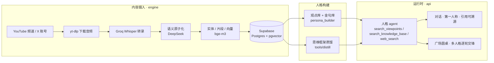

<div align="center">

# SenseClip

**把任意创作者的公开内容,变成一个会说话、有出处、以第一人称回答的 AI 人格 —— 再让几个人格同台圆桌对谈。**

Turn any creator's public content into a first-person, citation-grounded AI persona — then put several personas on stage for a live roundtable.

[在线体验](https://mailuo.vercel.app) · [部署指南](docs/deploy.md) · [人格配置](docs/personas.md) · [贡献指南](CONTRIBUTING.md) · [English](#english)

   

</div>

---

## 这是什么

一个博主几百期视频、几千条推文,散落在平台里,谁也不可能全看完。SenseClip 把它们**全部吃进来、拆成语义原子、建成可检索的记忆库**,再从记忆里提炼出这个人的**观点、金句和思维框架**,最后让一个 AI 以"他本人"的口吻回答你的问题——每一句话都能点回原视频的那一秒。

在此之上还有一个**广场**:选两位博主、抛一个话题,他们各自查自己的记忆库亮观点、逐轮互相反驳,你可以随时插话追问,聊多少轮都行。

目前内置两个示例人格:政经评论博主**鲁社长**、TRON 创始人**孙宇晨(孙割)**。新增一个博主只需要一个 YAML 文件。

## 亮点

| | |
|---|---|
| **无需训练的人格** | 观点库(结构化立场)+ 金句库(风格锚点)+ 蒸馏出的思维框架 + 最近发帖的实时语气样本,四层材料在推理时组装,零微调 |
| **句句有出处** | 回答里的 `[N]` 可点击跳到原视频片段;推文引用直接链到原推。不是"像他说的",是"他确实说过" |
| **第一人称** | 不是"分析他观点的助手",而是"我就是他":口吻、招牌用词、确定与犹豫的分寸都来自语料 |
| **广场圆桌** | 多人格逐轮交锋,流式逐句显示、历史可回看、可续聊、观众可插话;发言被截断会自动重生成 |
| **弹性模型链** | DeepSeek 主力,Claude 兜底:内容审查拒答、软拒绝("无法处理")、服务过载、中途断流、余额耗尽——五种失败全部自动切换,用户无感 |
| **全自动内容摄入** | YouTube 频道每 20 分钟巡航,新视频自动转录(Whisper)、原子化、实体抽取、向量化;X 推文定时抓取;余额不足自动熔断 |
| **可选计费** | 积分制 + Stripe 订阅/加油包,`BILLING_ENABLED=false` 即纯自用,前端自动隐藏计费入口 |
| **国内网络友好** | 长请求改为提交 + 短轮询(跨境长连接被掐也不丢结果);Supabase 走同源反代 |

## 工作原理



1. **摄入**:引擎巡航频道 → 下载音频 → Whisper 转录 → 大模型把字幕切成"语义原子"(一个完整观点为一个单位)→ 抽取实体、切叙事片段、bge-m3 向量化入库
2. **建人格**:遍历全部原子,抽取 `{主题, 立场, 推理逻辑, 确定度, 原话}` 组成观点库,抽取签名式表达组成金句库;再从语料蒸馏出一份"思维框架"(世界观 / 决策模式 / 表达风格 / 确定度分级 / 盲区)
3. **回答**:agentic 循环——先查观点库锁定既有判断,再查原文找证据,需要时联网;检索到的每条内容自动编号,模型只写内联 `[N]`,前端渲染为可点击引用
4. **圆桌**:每位嘉宾每轮一次生成,预检索各自的观点与金句,把其他人的发言放进上下文,流式写回数据库,前端逐句显示

## 快速开始

### 云端(推荐,10 分钟)

1. **数据库**:新建 [Supabase](https://supabase.com) 项目,在 SQL Editor 执行 [`supabase/migrations/00000000000000_baseline.sql`](supabase/migrations/00000000000000_baseline.sql)(幂等,32 张表 + 向量索引 + RLS 一步到位)
2. **后端**:用根目录 `Dockerfile` 部署两个实例(Railway / Fly / 任意容器平台),环境变量见下表;一个 `SERVICE_MODE=api`,一个 `SERVICE_MODE=engine`
3. **前端**:Vercel 导入仓库,Root Directory 填 `apps/web`,配置 `VITE_API_URL`、`VITE_SUPABASE_ANON_KEY`、`VITE_SUPABASE_DIRECT_URL`
4. **开工**:登录后到 `/settings` 上传 YouTube cookies,调用一次 `POST /api/admin/backfill/start` 加入频道,剩下的引擎自动完成

### 本地

```bash
git clone https://github.com/JoreyYan/senseclip && cd senseclip
cp .env.example .env              # 填 Supabase URL / keys + 至少一个模型 key
supabase start                    # 本地 Postgres + Auth + Storage(需 Docker;会自动应用迁移)
docker compose up --build         # api :8000 · engine :8001 · web :5173
```

不用 Docker:`cd apps/api && uvicorn api.server:app --reload`,`cd apps/web && npm i && npm run dev`。

完整说明与排障见 [docs/deploy.md](docs/deploy.md)。

## 配置一览

| 变量 | 必填 | 说明 |
|---|---|---|
| `SUPABASE_URL` / `SUPABASE_KEY` / `SUPABASE_ANON_KEY` | ✅ | 数据库;`SUPABASE_KEY` 为 service_role,只放服务端 |
| `ADMIN_KEY` | ✅ | 管理端点(巡航、人格构建等)的鉴权 |
| `GROQ_API_KEY` | 处理视频时 | Whisper 转录 |
| `DEEPSEEK_API_KEY` / `CLAUDE_API_KEY` | 至少一个 | 问答与处理;两个都填即获得自动兜底链 |
| `SILICONFLOW_API_KEY` 或 `OPENAI_API_KEY` | ✅ | 向量化(bge-m3 1024 维 / text-embedding-3) |
| `TAVILY_API_KEY` | 可选 | 联网搜索工具 |
| `TWITTERAPI_KEY` | 可选 | X 推文抓取(twitterapi.io) |
| `BILLING_ENABLED` + `STRIPE_*` | 可选 | 计费模块;默认关闭 |
| `PROMPT_LANG` | 可选 | 提示词语言 `zh`(默认)/ `en` |
| `BACKFILL_CONCURRENCY` / `BACKFILL_RESCAN_MINUTES` / `BACKFILL_MAX_SECONDS` | 可选 | 引擎并发 / 巡航间隔 / 跳过超长视频 |
| `GUEST_DAILY_LIMIT` / `CONSULT_COST` / `ROUNDTABLE_COST` / `ROUNDTABLE_ROUND_COST` / `SIGNUP_BONUS_CREDITS` | 可选 | 游客额度与积分价格 |

全部变量与默认值见 [`.env.example`](.env.example)。

## 新增一个博主

```yaml
# personas/someone.yaml
key: someone
label: 某某
desc: 一句话身份描述
channels: [SomeYouTubeHandle, x_someusername]
avatar: /avatar-someone.jpg
first_person: true
```

然后:`POST /api/admin/backfill/start`(拉频道)→ 内容入库后 `POST /api/admin/persona/build {"persona":"someone"}`(建观点库)→ `python tools/distill/distill_framework.py`(蒸馏框架)。前端的模式按钮和圆桌嘉宾自动出现。字段说明见 [docs/personas.md](docs/personas.md)。

## 主要接口

| 接口 | 用途 |
|---|---|
| `POST /api/chat` | 标准问答(全库检索 + 引用) |
| `POST /api/consult/submit` → `GET /api/consult/poll` | 人格模式(`persona` 参数);异步提交 + 轮询,轮询返回实时进度 |
| `POST /api/roundtable/submit` → `GET /api/roundtable/{id}` | 广场圆桌;`POST /api/roundtable/{id}/continue` 续聊(可附观众插话) |
| `GET /api/personas` | 当前可用人格(前端动态渲染) |
| `POST /api/admin/backfill/start` · `/xpoller/start` · `/persona/build` · `/persona/register` | 引擎与人格管理(需 `X-Admin-Key`) |
| `POST /api/feedback` · `/api/report-error` | 👍/👎 与一键异常上报(自动附带服务端诊断) |

## 项目结构

```
apps/api/            FastAPI 服务(同一镜像;SERVICE_MODE=api 产品服务 / engine 处理引擎)
  api/server.py         路由、人格 agent、圆桌编排、计费
  api/backfill_worker.py 频道巡航与视频处理调度
  api/persona_builder.py 观点库 / 金句库构建
  api/x_poller.py        X 推文抓取
  utils/api_client.py    DeepSeek → Claude 弹性调用链
  supabase_pipeline.py + atomizers/ structurers/ vectorizers/   转录后的处理流水线
  prompts/               提示词模板(zh / en)
apps/web/            Vite + React 前端(对话、广场、积分中心、视频库、群英图)
supabase/            数据库基线迁移
personas/            人格 YAML(示例:鲁社长、孙割)
tools/distill/       思维框架蒸馏
docs/                部署与配置文档
```

## 路线图

- [ ] 增量学习:新视频 / 新推文自动进入观点库,思维框架定期自动再蒸馏
- [ ] `server.py` 按 ingest / persona / runtime / billing 拆包
- [ ] 无 Supabase 的本地模式(sqlite + 本地向量库),`pip install` 即可跑
- [ ] 人格包导入 / 导出,社区人格索引
- [ ] 更多信息源插件:播客 RSS、Bilibili、本地文件
- [ ] 测试与 CI

## 使用规范

本项目生成的人格是**基于公开内容的 AI 模拟,不代表本人**。部署者须在界面明确标注 AI 模拟身份(内置前端已标注),不得用于冒充、欺骗或诽谤;为真实人物构建人格前请评估授权与当地法律。仓库不包含任何创作者的转录、原子或衍生数据,示例人格需要你自行摄入其公开内容。

## 贡献

欢迎 issue 与 PR,见 [CONTRIBUTING.md](CONTRIBUTING.md)。

## English

**SenseClip** ingests a creator's public videos and tweets (auto-crawl → Whisper → semantic "atoms" → entities → bge-m3 embeddings), then—without any fine-tuning—distills a **viewpoint library** (structured stances with evidence), a **quote library** (style anchors) and a **thinking framework**, and serves a **first-person persona agent** whose every claim links back to the exact source clip. Several personas can debate a topic in a **streaming, resumable roundtable** where the audience may interject.

Under the hood: a resilient LLM chain (DeepSeek → Claude) transparently handles censorship refusals, soft refusals, overload, broken streams and exhausted balance; long jobs use submit + short polling so cross-border connections never lose a result; billing (credits + Stripe) is optional. Personas are plain YAML files under `personas/`; prompts are templated per language (`PROMPT_LANG=en`). Deployment: Supabase (Postgres + pgvector) + two containers from the root `Dockerfile` (`SERVICE_MODE=api|engine`) + a Vite frontend — see `docs/deploy.md`.

Personas are AI simulations built from public content and must be labeled as such; do not use them to impersonate, deceive or defame.

---

Apache-2.0 © 2026 Jorey Yan and contributors
